## Code Licensing
If I ever contributed to Your project and You suddenly want to change its license, You are allowed to change it to MIT or MPLv2 or BSDv3 or any official version of GPLv2/AGPLv2/LGPLv2 and later, without asking me for permission. THIS IS YOUR PERMISSION to do so FOLLOWING WHAT'S WRITTEN HERE (HERE - means latest version[commit] of this readme)! If You want to change it to any other license please contact me via email so we could figure things out.

## About me
You can chat with me `@darukutsu:hento.org` or come and hang out with boys on [ani-cli matrix space](https://github.com/pystardust/ani-cli/blob/master/matrix.md)

  
  

|  |   |
| -- | -- |

<!--
|  |   |
| -- | -- |
-->
